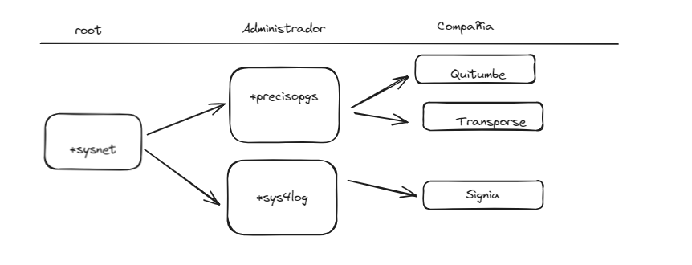

# Backend E-Driver


## Descripción

`backend_edriver` es el backend de una plataforma web hecha en Vue y un aplicativo móvil hecho en Flutter. Esta plataforma se conecta mediante un servicio externo a Wialon para asignar y desasignar placas de vehículos a choferes. Este sistema es esencial para gestionar grandes flotas, asegurando que cada chofer esté asignado a una unidad específica y que el equipo de seguimiento tenga datos actualizados sobre qué chofer está manejando cada unidad de transporte.

## Tecnologías

- **Node.js** y **Express** para la creación del servidor.
- **TypeScript** para un código más robusto y mantenible.
- **MySQL** para la base de datos.
- **Docker** para la creación de contenedores y despliegue.

## Arquitectura

El proyecto sigue una arquitectura modular, permitiendo una mejor organización y escalabilidad del código. Las diferentes funcionalidades están separadas en módulos, cada uno con sus propios controladores, servicios y rutas.

## Instalación

Para ejecutar este proyecto en tu entorno local, sigue los siguientes pasos:

1. Clona el repositorio:

    ```bash
    git clone https://github.com/tu_usuario/backend_edriver.git
    cd backend_edriver
    ```

2. Instala las dependencias:

    ```bash
    npm install
    ```

3. Crea un archivo `.env` en la raíz del proyecto con las siguientes variables de entorno:

    ```env
    DB_HOST=tu_db_host
    DB_PORT=tu_db_port
    DB_USER=tu_db_user
    DB_PASSWORD=tu_db_password
    DB_NAME=tu_db_name
    SECRET_KEY=tu_secret_key
    ```

4. Inicia el servidor:

    ```bash
    npm start
    ```

## Uso

El backend expone varios endpoints para la gestión de choferes y vehículos. Estos endpoints están documentados y se pueden probar utilizando herramientas como Postman o cURL.



## Contribuciones

Si deseas contribuir al proyecto, por favor sigue estos pasos:

1. Haz un fork del repositorio.
2. Crea una nueva rama (`git checkout -b feature/nueva-funcionalidad`).
3. Realiza tus cambios y haz commit de los mismos (`git commit -am 'Agrega nueva funcionalidad'`).
4. Sube tus cambios a tu fork (`git push origin feature/nueva-funcionalidad`).
5. Abre un Pull Request.

## Licencia

Este proyecto está licenciado bajo la Licencia MIT. Para más detalles, consulta el archivo [LICENSE](LICENSE).

## Contacto

Para cualquier consulta, por favor contacta a [Rafael](mailto:rosselgalarzarafael@gmail.com).

---

¡Gracias por utilizar `backend_edriver`!


